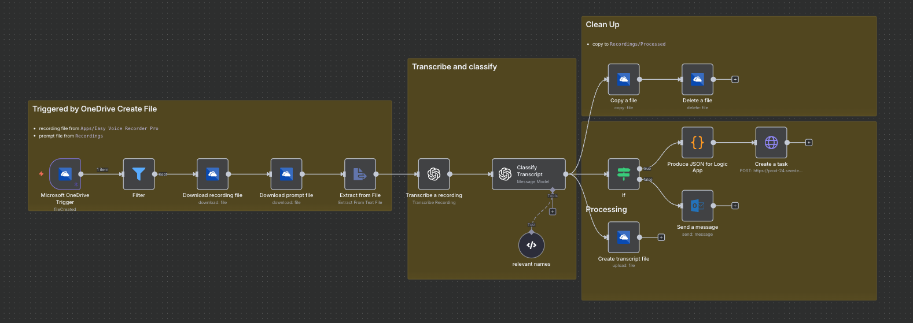

# Dapr Agent Flow

This repository explores personal productivity flows using the **Dapr Agents** framework, implementing voice-to-action workflows that automatically process voice recordings and execute appropriate actions.

> **DISCLAIMER**: Almost 95% created with GitHub Copilot

The implementation is based on a [N8N](https://n8n.io) flow that monitors voice recordings on OneDrive, transcribes them, classifies the content, and determines whether to create tasks or send email notifications.



## Voice2Action Workflow

The Voice2Action workflow implements an end-to-end voice processing pipeline with three main stages:

### FR001: OneDrive Voice Recording Download
- Polls a OneDrive folder for new voice recordings (`audio/x-wav` and `audio/mpeg` files only)
- Downloads only files not previously processed
- Automatic polling at configurable intervals
- Uses MSAL client credentials flow for Graph API authentication

### FR002: Voice Transcription  
- Transcribes voice recordings using OpenAI Whisper API
- Stores transcription in JSON format alongside the original file
- Preserves file structure and metadata

- Uses Dapr Agents with Intent Orchestrator to analyze transcriptions
- Determines appropriate actions based on content:
  - **Task Creation**: Creates todo items for detected commands/reminders
  - **Email Fallback**: Sends email notifications for general notes
- Implements agent-based architecture with specialized agents


## Architecture

The system uses the following components:

### Dapr Workflow Orchestration
- **Worker Services**: Handle workflow execution and pub/sub event processing
- **Activities**: Implement individual workflow steps (download, transcribe, classify)
- **State Management**: Persistent storage via Dapr state store for workflow state and file tracking

### Intent Orchestrator Framework
- **Intent Orchestrator** (port 5100): Coordinates agent interactions and workflow decisions  
- **TaskPlanner Agent** (port 5101): Specialized agent for creating and managing tasks
- **FallbackEmailer Agent** (port 5102): Handles email notifications for unclassified content

### Services
- **OneDrive Integration**: MS Graph API for file operations with automatic token management
- **OpenAI Integration**: Whisper API for transcription, GPT models for content classification
- **HTTP Client**: Reusable service for external API calls
- **State Stores**:
  - Workflow/Actor state: SQLite via `components/workflowstate.yaml` (actorStateStore=true)
  - Token cache store: Redis via `components/tokenstate.yml` (name: `tokenstatestore`) used by MSAL for durable token cache

## Environment Configuration

### Required Environment Variables

```bash
# OneDrive Configuration
ONEDRIVE_VOICE_INBOX="/folder/sub-folder"    # OneDrive folder path to monitor
ONEDRIVE_VOICE_POLL_INTERVAL=30              # Polling interval in seconds (min: 5)

# MS Graph Authentication (MSAL Client Credentials)
MS_GRAPH_CLIENT_ID="your-client-id"
MS_GRAPH_CLIENT_SECRET="your-client-secret"
MS_GRAPH_AUTHORITY="https://login.microsoftonline.com/consumers"  # Default

# OpenAI Configuration  
OPENAI_API_KEY="your-openai-api-key"
OPENAI_CLASSIFICATION_MODEL="gpt-4.1-mini"    # Default model for classification

# Local Storage
VOICE_DOWNLOAD_DIR="./.work/voice"       # Local directory for downloads
```

### Optional Environment Variables

```bash
# Dapr Configuration
STATE_STORE_NAME="workflowstatestore"                # Dapr state store component name
DAPR_PUBSUB_NAME="pubsub"                   # Dapr pub/sub component name
DAPR_LOG_LEVEL="info"                       # Logging level

# Intent Orchestrator Topic
DAPR_INTENT_ORCHESTRATOR_TOPIC="IntentOrchestrator"  # Pub/sub topic for intent orchestrator
# Token Cache State Store (MSAL)
TOKEN_STATE_STORE_NAME="tokenstatestore"     # Dapr state store component name for token cache

# Development/Debugging
DEBUGPY_ENABLE="0"                          # Enable remote debugging (1/0)
PYDEVD_DISABLE_FILE_VALIDATION="1"          # PyCharm debugging optimization
```

## Quick Start

### 1. Setup Dependencies

```bash
# Install dependencies (Python virtual environment recommended)
pip install -r requirements.txt

# Create necessary directories
mkdir -p ./.work/voice
```

### 2. Configure Environment

Set up your credentials (store securely in production):

```bash
# OneDrive/Graph Configuration  
export ONEDRIVE_VOICE_INBOX="/Recordings/Inbox"
export MS_GRAPH_CLIENT_ID="your-azure-app-client-id"
export MS_GRAPH_CLIENT_SECRET="your-azure-app-client-secret"

# OpenAI Configuration
export OPENAI_API_KEY="your-openai-api-key"
```

### 3. Run the Complete System

Start all services using the Dapr multi-app runner:

```bash
dapr run -f master.yaml
```

This starts:
- **authenticator** (port 5000): Initial Graph authentication helper
- **workflows**: Workflow polling and orchestration worker  
- **worker-voice2action** (port 5001): Voice2Action workflow worker with pub/sub subscriber
- **intent-orchestrator** (port 5100): Intent-based action planning orchestrator
- **agent-taskplanner** (port 5101): Task creation agent
- **agent-fallback-emailer** (port 5102): Email notification agent

### 4. Initial Authentication

With MSAL client credentials, no manual token provisioning is required; tokens are acquired and refreshed automatically and stored in the `tokenstatestore`.

Optionally, if using an interactive flow, you can use the authenticator service:
```bash
# Navigate to http://localhost:5000 to complete OAuth flow
# Tokens are automatically stored in Dapr state store for reuse
```

## Monitoring and Logs

- **Workflow State**: Check Dapr state store for workflow execution status
- **Agent States**: Individual agents maintain state in `{AgentName}_state.json` files
- **File Processing**: Monitor `./.work/voice/` for processed recordings and transcriptions
- **Logs**: All services output structured logs with correlation IDs for tracing

## Development

The codebase follows Dapr Agents best practices:
- **Deterministic Orchestrators**: No I/O operations in workflow orchestrators
- **Idempotent Activities**: All activities support retry and state recovery
- **Event-Driven Architecture**: Pub/sub messaging between workflows and agents
- **Structured Logging**: Consistent logging format with correlation tracking

See [voice2action-requirements.md](./voice2action-requirements.md) for detailed functional and technical requirements.

